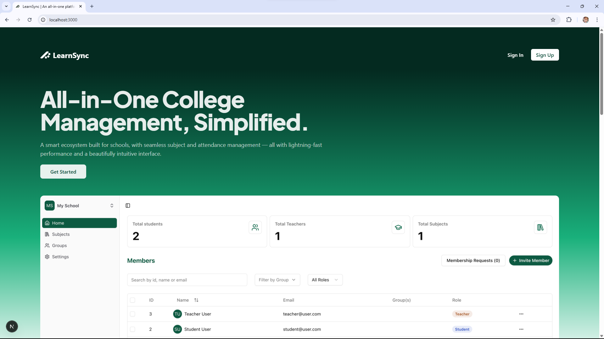
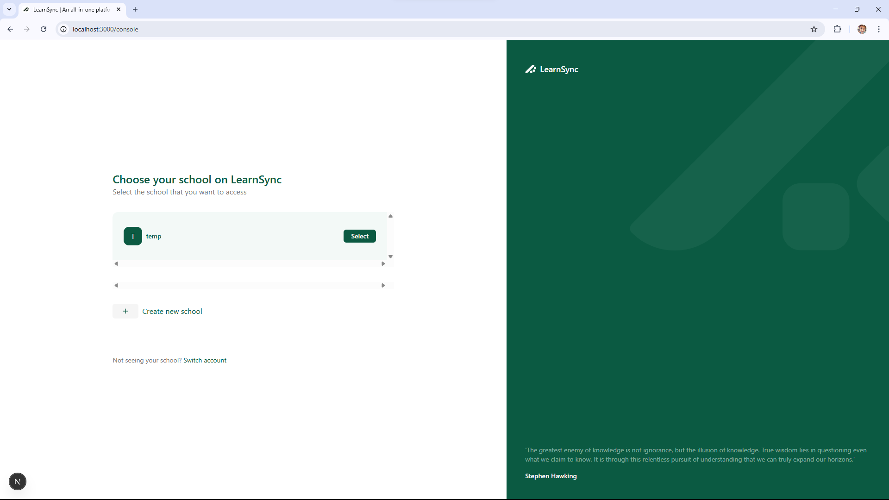
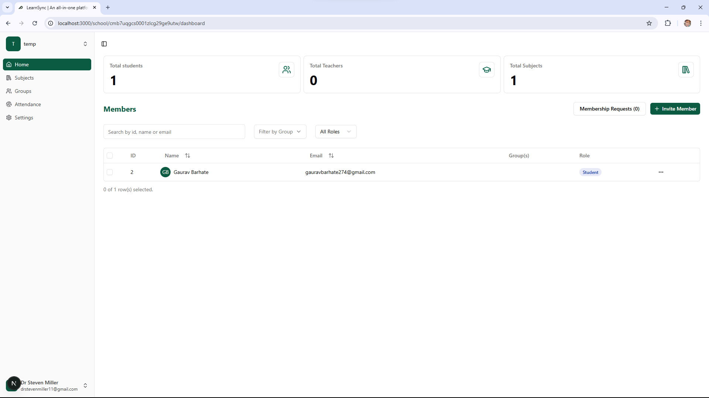

LearnSync – School Management System
===================================

LearnSync is a full‑stack school management platform that helps administrators and teachers manage schools, subjects, users, groups, attendance, assignments, files, and more. It provides a clean, modern UI (Next.js + Tailwind) and a robust API (Express + Prisma + PostgreSQL).

Tech Stack
---------
- Frontend: Next.js 15, React 19, TypeScript, Tailwind CSS 4, TanStack Query, Zod, Radix UI
- Backend: Node.js + Express, Prisma ORM, PostgreSQL (Neon compatible)
- Auth: JWT (cookie), optional Google OAuth implicit flow
- Storage/Uploads: Cloudinary
- Testing/Tooling: Vitest, ESLint, Prettier

Monorepo Layout
---------------
```
School-Management-System/
  backend/
  frontend/
  README.md
  preparation.txt
```

Quick Start
-----------

Prereqs
- Node.js 20+
- PostgreSQL database (or Neon)

Backend
1. Copy env template and fill values
   - See `backend/backend/env-template.txt`
2. Install & run
```
cd backend/backend
npm i
npm run prisma:generate # if script exists, otherwise npx prisma generate
npm run dev
```
The API runs on `http://localhost:5000/api` by default (see `index.ts`).

Frontend
1. Create `frontend/frontend/.env.local`
```
NEXT_PUBLIC_APP_URL=http://localhost:3000
NEXT_PUBLIC_BACKEND_URL=http://localhost:5000
# Optional for Google OAuth
NEXT_PUBLIC_GOOGLE_CLIENT_ID=YOUR_GOOGLE_OAUTH_WEB_CLIENT_ID
```
2. Install & run
```
cd frontend/frontend
npm i
npm run dev
```
The app runs on `http://localhost:3000`.

Core Features
-------------
- User auth (email/password, JWT cookies; Google OAuth optional)
- Schools: create, edit, delete; invite links; admissions
- Members & Roles: ADMIN, TEACHER, STUDENT
- Groups: create, assign/unassign members
- Subjects: CRUD, member assignments, topics, documents
- Assignments: create, submit, grade table scaffolding
- Attendance: sessions, device credentials, logs
- File uploads: Cloudinary integration
- Robust UX: React Query caching, dialogs, toasts, tables, filters

Screenshots
-----------







Notable API Routes
------------------
- `POST /api/login`, `POST /api/register`
- `POST /api/school/:id/invite` – create invite token
- `GET /api/school/:id/invitation` – list invite tokens
- `DELETE /api/school/:id/invitation/:tokenId` – delete token
- `POST /api/invite/:inviteToken` – accept invite (requires auth)

See `backend/backend/routes/*.ts` and controllers for full list.

Development Notes
-----------------
- Frontend talks to backend through `axiosInstance` using `NEXT_PUBLIC_BACKEND_URL`.
- React Query caches lists like `schoolInvitations` and is invalidated after mutations.
- Forms use `react-hook-form` + `zod` with accessible `Form*` components.
- Middleware protects `/console` and `/school/*` based on `token` cookie.

Build
-----
```
# frontend
cd frontend/frontend && npm run build
# backend (ts -> js via tsc or bun, depending on scripts)
cd backend/backend && npm run build
```

License
-------
MIT


